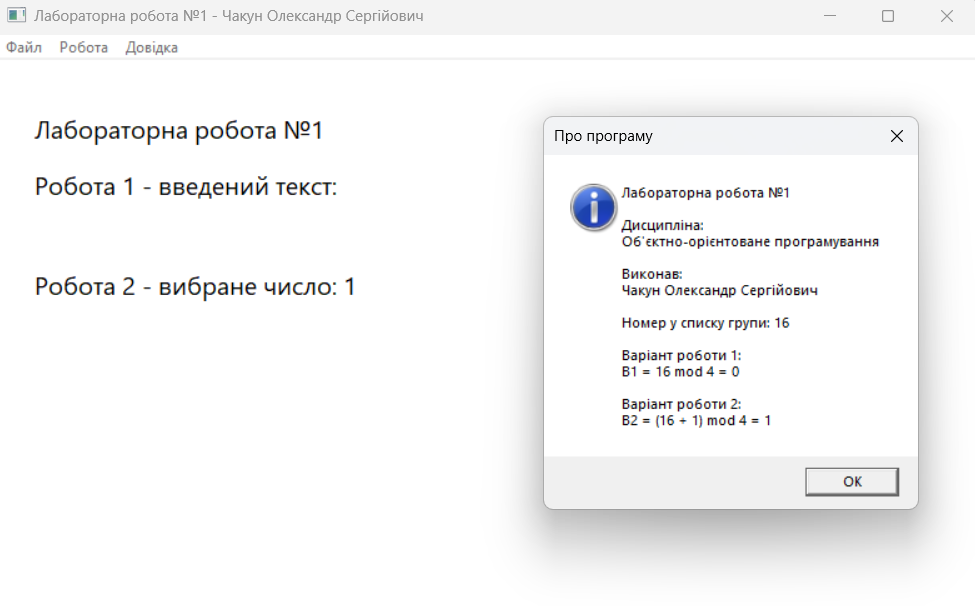
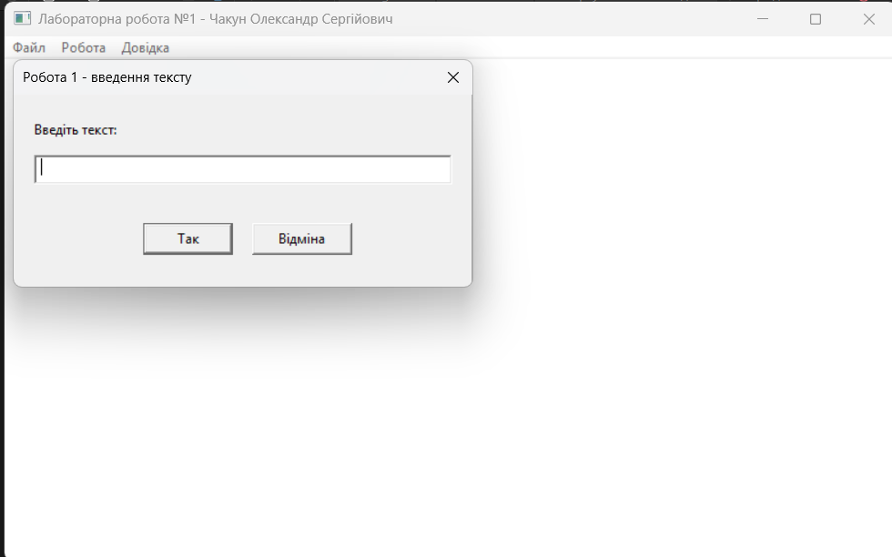
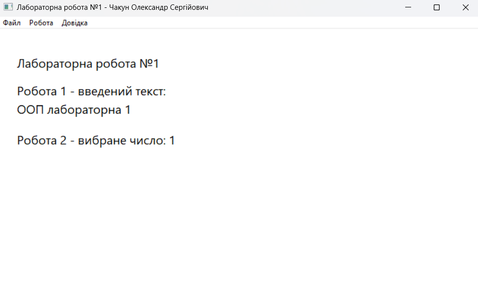
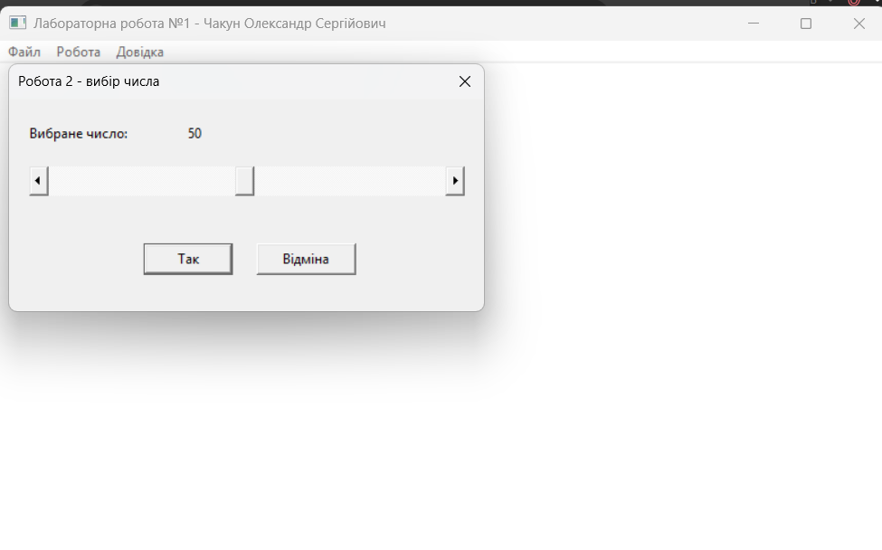
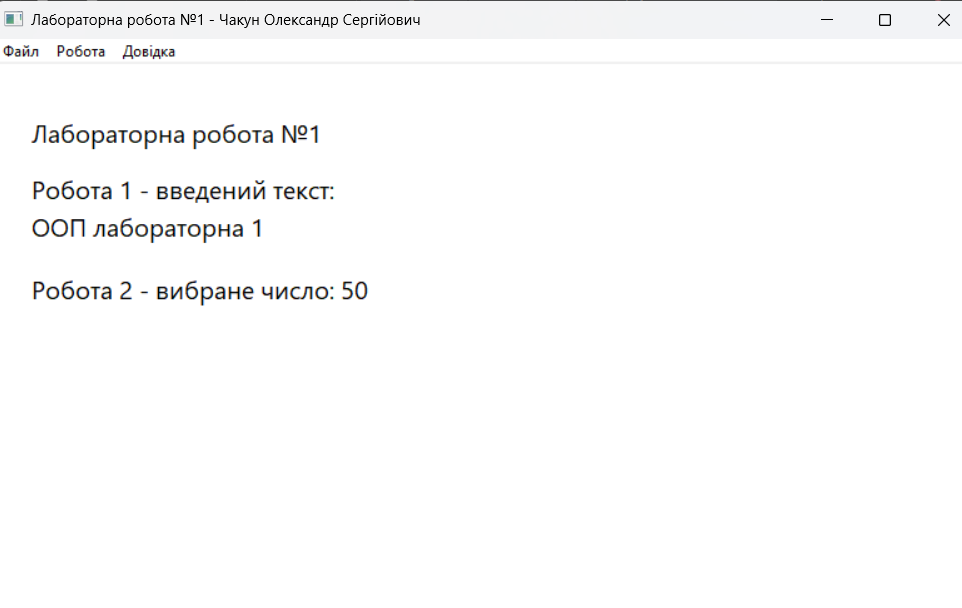

<div style="text-align: center; font-size: 24px; margin-top: 60px;">

Міністерство освіти і науки України

Національний технічний університет України

«Київський політехнічний інститут імені Ігоря Сікорського»

Факультет інформатики та обчислювальної техніки

Кафедра обчислювальної техніки

</div>

<div style="text-align: center; margin-top: 120px;">

<h1 style="font-size: 22px;">Лабораторна робота №1</h1>

<h2 style="font-size: 22px;">з дисципліни «Об'єктно-орієнтоване програмування»</h2>

<h3 style="font-size: 22px; margin-top: 20px;">на тему</h3>

<h2 style="font-size: 22px;">«Знайомство із середовищем розробки програм Microsoft Visual Studio та складання модульних проєктів програм на C++»</h2>

</div>

<div style="text-align: right; margin-top: 120px; font-size: 18px;">

<strong>Виконав:</strong><br>
Чакун Олександр Сергійович<br>
студент групи ІМ-051<br>
номер у списку групи: 16<br><br>

<strong>Перевірив:</strong><br>
Рекечинський Дмитро Олександрович

</div>

<div style="text-align: center; margin-top: 120px; font-size: 20px;">

Київ 2026

</div>

---

## Завдання

1. Створити у середовищі MS Visual Studio C++ проєкт Windows Desktop Application з ім'ям `Lab1`.
2. Написати вихідний текст програми згідно варіанту завдання.
3. Скомпілювати вихідний текст і отримати виконуваний файл програми.
4. Перевірити роботу програми та виконати налагодження.
5. Проаналізувати та прокоментувати результати роботи й вихідний текст програми.
6. Реалізувати програму у модульному стилі: функції «Робота 1» і «Робота 2» розмістити в окремих незалежних модулях.
7. Оформити звіт із вихідним кодом, схемою залежностей, скріншотами та висновками.

---

## Завдання згідно варіанту

Номер студента у списку групи:

```text
Ж = 16
```

Варіант для «Робота 1»:

```text
В1 = Ж mod 4
В1 = 16 mod 4 = 0
```

Для варіанта `0` потрібно створити діалогове вікно з елементом **Edit Control** та кнопками «Так» і «Відміна». Користувач вводить рядок тексту, після чого натискає «Так». Введений рядок повинен відображатися у клієнтській області головного вікна.

Варіант для «Робота 2»:

```text
В2 = (Ж + 1) mod 4
В2 = 17 mod 4 = 1
```

Для варіанта `1` потрібно створити діалогове вікно з горизонтальним **Scroll Bar** та кнопками «Так» і «Відміна». Повзунок використовується для введення числа у діапазоні від `1` до `100`. Після натискання «Так» вибране число повинно відображатися у головному вікні програми.

---

## Структура реалізації

Головний файл `Lab1.cpp` відповідає за реєстрацію класу вікна, створення головного вікна, цикл обробки повідомлень, команди меню та відображення результатів. Модуль `module1` реалізує введення тексту, а модуль `module2` — введення числа за допомогою горизонтального Scroll Bar.

Callback-функції діалогових вікон оголошені як `static`, тому вони залишаються внутрішніми деталями відповідних модулів.

---

## Діаграма залежностей файлів та модулів

```text
                          Lab1.cpp
                     ┌────────┼────────┐
                     │        │        │
                     ▼        ▼        ▼
               resource.h  module1.h module2.h
                              │         │
                              │         │
                       ┌──────┘         └──────┐
                       ▼                       ▼
                  module1.cpp             module2.cpp
                   │       │               │       │
                   ▼       ▼               ▼       ▼
              module1.h resource.h    module2.h resource.h

Lab1.rc ────────────────► ../src/resource.h
module1.rc ─────────────► ../src/resource.h
module2.rc ─────────────► ../src/resource.h
```

Модулі `module1` і `module2` не мають перехресних `#include`-зв'язків.

---

## Скріншоти

### Головне вікно програми



_Рис. 1. Головне вікно програми._

---

### Діалог «Робота 1»



_Рис. 2. Діалогове вікно для введення тексту._

---

### Результат «Робота 1»



_Рис. 3. Виведення введеного тексту у головному вікні._

---

### Діалог «Робота 2»



_Рис. 4. Діалогове вікно з горизонтальним Scroll Bar._

---

### Результат «Робота 2»



_Рис. 5. Виведення вибраного числа у головному вікні._

---

## Висновки

У лабораторній роботі було створено Windows-застосунок на C++ з використанням Windows API та модульної структури. Для номера у списку `16` реалізовано варіанти `В1 = 0` та `В2 = 1`.

У першому модулі реалізовано діалогове вікно для введення тексту за допомогою `Edit Control`. У другому модулі реалізовано вибір числа у діапазоні від 1 до 100 за допомогою горизонтального `Scroll Bar`. Отримані значення передаються у головний модуль та відображаються у клієнтській області головного вікна.

Під час виконання роботи було практично опрацьовано створення Win32-вікон, цикл повідомлень, Callback-функції, повідомлення `WM_COMMAND`, `WM_PAINT` і `WM_HSCROLL`, модальні діалогові вікна, ресурсні файли `.rc`, Unicode та роздільну компіляцію модулів.
